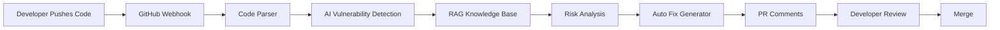
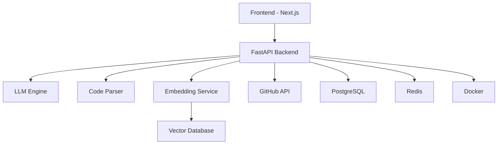

# 🕵️‍♂️ Sher-e-Code
### AI-Powered Secure Code Review & Vulnerability Detection Platform

<p align="center">


</p>

---

# 🚀 "Your AI Security Engineer"

Sher-e-Code is an **AI-powered Static Application Security Testing (SAST) platform** that detects security vulnerabilities, explains why they occur, automatically suggests secure fixes, and generates pull requests with remediations.

Instead of overwhelming developers with cryptic warnings, Sher-e-Code behaves like an experienced security engineer reviewing every line of code.

---

# 🎥 Demo

> 🚧 Demo Coming Soon


---

# ✨ Features

- 🔍 AI-powered vulnerability detection
- 🤖 Automatic secure code fixes
- 📖 Natural language explanations
- ⚡ GitHub Pull Request reviews
- 🧠 CVE & CWE knowledge retrieval (RAG)
- 📊 Risk Scoring Dashboard
- 🔐 OWASP Top 10 Detection
- 🧩 Multi-language support
- 📄 SARIF Export
- 🛠 CI/CD Integration
- ☁ Cloud Native
- 📈 Security Trend Analytics

---

# 📸 Dashboard Preview

```
┌───────────────────────────────────────────────┐
│             Sher-e-Code Dashboard            │
├───────────────────────────────────────────────┤
│ High Risk      12                             │
│ Medium Risk    31                             │
│ Low Risk       47                             │
│ AI Fixed       19                             │
│ Security Score 91/100                         │
└───────────────────────────────────────────────┘
```

---

# 🧠 How it Works



---

# 🏗 Architecture



---

# 🛡 Supported Vulnerabilities

| Category | Supported |
|------------|-----------|
| SQL Injection | ✅ |
| Command Injection | ✅ |
| XSS | ✅ |
| SSRF | ✅ |
| XXE | ✅ |
| Authentication Issues | ✅ |
| JWT Problems | ✅ |
| Weak Cryptography | ✅ |
| Hardcoded Secrets | ✅ |
| Race Conditions | ✅ |
| Path Traversal | ✅ |
| Insecure Deserialization | ✅ |

---

# 🤖 AI Pipeline

```text
Repository

↓

Parse Code

↓

AST Generation

↓

LLM Analysis

↓

Similarity Search

↓

CWE Matching

↓

Severity Ranking

↓

Secure Patch Generation

↓

Pull Request Comment
```

---

# 📂 Project Structure

```
Sher-e-Code/

├── backend/
│   ├── api/
│   ├── ai/
│   ├── parser/
│   ├── rag/
│   ├── models/
│   └── database/
│
├── frontend/
│   ├── dashboard/
│   ├── components/
│   ├── pages/
│   └── assets/
│
├── agents/
│
├── prompts/
│
├── embeddings/
│
├── docker/
│
├── docs/
│
├── tests/
│
└── README.md
```

---

# 🧩 Tech Stack

## Frontend

- Next.js
- React
- TailwindCSS
- TypeScript
- ShadCN UI

## Backend

- FastAPI
- Python
- SQLAlchemy
- Redis
- Celery

## AI

- OpenAI
- Ollama
- Llama 3
- Code Llama
- LangChain
- LlamaIndex

## Database

- PostgreSQL
- ChromaDB
- Redis

## DevOps

- Docker
- GitHub Actions
- Kubernetes
- Terraform

---

# 🧠 AI Agents

| Agent | Responsibility |
|---------|----------------|
| Sherlock | Detect vulnerabilities |
| Watson | Explain findings |
| Moriarty | Generate exploits |
| Guardian | Suggest secure fixes |
| Inspector | Validate patches |

---

# 📈 Security Score

Every repository receives a live security score.

```
95-100   Excellent

85-94    Good

70-84    Needs Attention

<70      High Risk
```

---

# 🚀 Quick Start

```bash
git clone https://github.com/rishi-3161/Sher-e-Code

cd Sher-e-Code

docker compose up
```

Backend

```bash
cd backend

pip install -r requirements.txt

uvicorn main:app --reload
```

Frontend

```bash
cd frontend

npm install

npm run dev
```

---

# ⚡ REST APIs

```
POST /scan

POST /repository

POST /analyze

POST /fix

GET /dashboard

GET /report

GET /history
```

---

# 📊 Roadmap

## Phase 1

- [x] Static Code Analysis
- [x] AI Explanations
- [x] Dashboard

## Phase 2

- [ ] GitHub App
- [ ] VS Code Extension
- [ ] Auto PR Generation
- [ ] Docker Images

## Phase 3

- [ ] Multi-Agent Review
- [ ] Enterprise SSO
- [ ] Slack Integration
- [ ] Jira Integration

## Phase 4

- [ ] AI Pentesting
- [ ] Runtime Detection
- [ ] Autonomous Security Agent

---

# 📚 Future Research

- AI-powered Secure Coding Assistant
- Reinforcement Learning for Vulnerability Detection
- Graph Neural Networks for Code Analysis
- Multi-Agent Code Review
- Explainable AI for Security

---

# 📊 Project Metrics

| Metric | Target |
|----------|---------|
| Languages | 20+ |
| Vulnerabilities | 150+ |
| CWE Coverage | 300+ |
| Repositories Tested | 10,000+ |
| Precision | 95% |
| Recall | 92% |

---

# 🤝 Contributing

Contributions are always welcome.

```bash
Fork

↓

Create Branch

↓

Commit

↓

Push

↓

Open Pull Request
```

---

# ⭐ Why Sher-e-Code?

Traditional scanners only report problems.

Sher-e-Code explains **why** the vulnerability exists, **how** attackers exploit it, and **how** to fix it automatically using AI.

It acts like an experienced AppSec engineer available 24/7.

---

# 👨‍💻 Author

**Rishi**

Security Engineer • Software Engineer • AI Builder

> *Building secure software with Agentic-AI.*

---

<p align="center">

⭐ If you like this project, give it a star!

</p>
